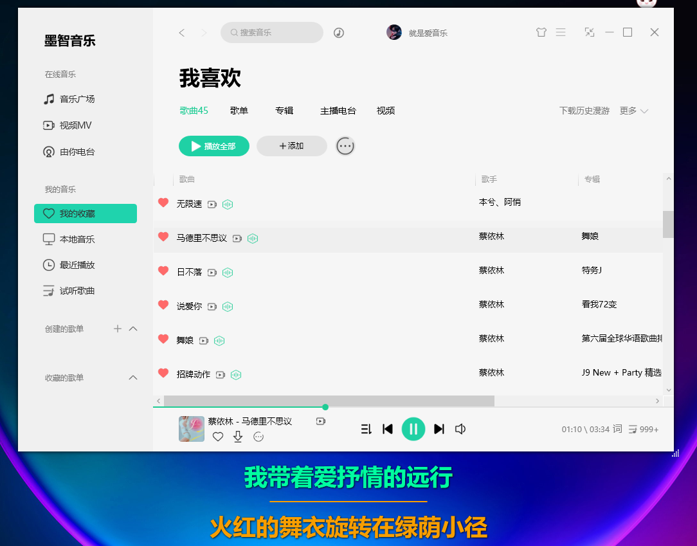

# MoZhiMusicPlayer
Imitateing the current mainstream music software of a certain T, based on dotNET_ C#_ WPF's personal open source music client
## Note: The performance or system version is low, which may affect the runtime performance. WIn11 is recommended. Win11 is specially optimized [doge]
# Function:
1. Support synchronized animation of lyrics and synchronized progress of lyrics (compatible with lyrics files of other music software)
2. Support cross broadcast of multi singer realistic animation
3. Basic music player functions (no need to explain these)
4. Basic song import (select import, local full disk scan import, support MP3, wav, flac music files (only scan files with singer song name and file name))
## Based on the AGPL-3.0 license open source agreement, you can intercept some of the code as you wish, stating that it is prohibited to use the solution for commercial purposes, and it is prohibited to use the solution as teaching, thesis and other knowledge, commercial property rights without the permission of the author (you need my permission, or you will be prosecuted for your illegal acts)
## Demo effect: (B station link: https://www.bilibili.com/video/BV1uG41137jY/?vd_source=6e56ca0b155a60e6a6878e5775fdcc35 ）
## Resource location: MoZhiMusicPlayer/MoZhiMusicPlayer_GithubAuthor_XiangCheng/bin/Debug/net6.0-windows/Resource/(Lyrics, artist portraits, album pictures, etc. can be edited by yourself) 
## Download additional music resources (Baidu online disk resources):
Link: https://pan.baidu.com/s/1LbmClxXrEsO4-R9ISBKCoQ?pwd=zake Extraction code: zake
Please unzip the resource compressed package of this network disk and overwrite it to MoZhiMusicPlayer  Mozi Music_ 3.0.1  bin  Debug , replace the folder with the same name
## (Statement: The author's personal music additional resources Baidu online disk resources (artist photos, album pictures, etc.) and this project file are all public data from the network, only for sharing, without any commercial infringement. If you have any objection, please contact me to delete
## My QQ learning group number: 228440692. Welcome to join the group. Give it to a star first. There are projects I have sorted out in the group, which is easier to use out of the box than my Github project 
 
 
 
